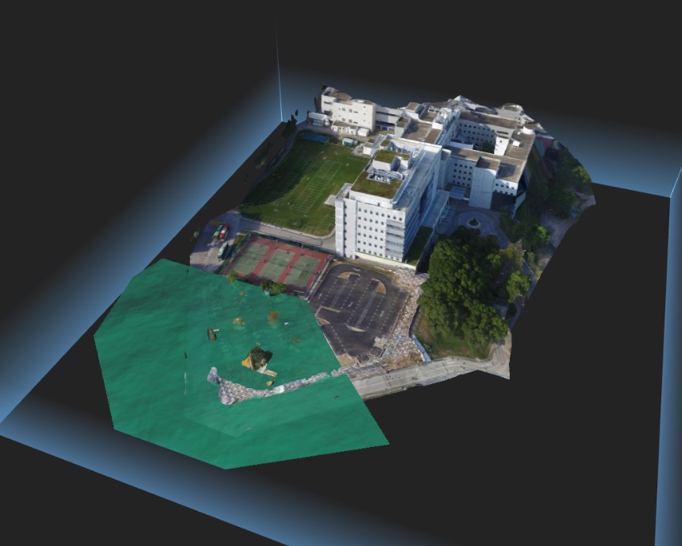

# Altizure SDK 離線部署

本教程提供壹個完全離線使用Altizure三維瀏覽服務的基本案例。

## 開始運行
* 在網頁根目錄發布本地服務
    ```
    cd <path>/altizure-sdk-offline/
    python -m SimpleHTTPSERVER 8000
    ```
    * 更詳細的資料介紹請參考 [3D SDK Quick Start](https://docs.altizure.cn/en/jssdk.html)

* 通過瀏覽器訪問 `http://localhost:8000/index.html` 查看案例

## 文件結構
本案例已經提供壹份數據供您測試，下載鏈接：
鏈接: https://pan.baidu.com/s/1tEEbjO2aC2OviDCV5_fdhQ  密碼: sjhw

您可以直接查看此三維數據，或者更改為您自己的數據。如果使用自己的數據，請遵照原本的文件夾結構，將數據和配置文件放置在正確的位置。

```
project
│   README.md
│   index.html
│   crop_and_water.html
│
└───public
│   └───data
│       └───<PID_1>
│       │   │   apiinfo-<PID_1>.json
│       │   └───web
│       │       │   *.ab
│       │       │   *.ab
│       │       │   ...
│       │       │   info.txt
│       └───<PID_2>
│       │   │   apiinfo-<PID_2>.json
│       │   │   crop_mask_<PID_2>.json (if it has)
│       │   │   water_mask_<PID_2>.json (if it has)
│       │   └───web
│       │       │   *.ab
│       │       │   *.ab
│       │       │   ...
│       │       │   info.txt
│       │   ...
│   
└───assets
│   └───img
│       └───waternormals.jpg
│   
└───js
    │   altizure-all.min.js
    │   altizure.min.js
```

+ `index.html` 是基本頁，包含json配置文件的請求和模型加載代碼。
+ `public\data\<PID>\web` 存儲了altizure三維模型的二進制數據。文件夾內部壹般是由多個 `.ab` 文件和壹個 `info.txt` 組成。
+ `public\data\<PID>\apiinfo-<PID>.json` 存儲了 altizure graphql api `project(<PID>)` 數據。
+ `public\data\<PID>\crop_mask_<PID>.json` 存儲了模型裁剪數據。
+ `public\data\<PID>\water_mask_<PID>.json` 存儲了模型水面數據。
+ `public\js\altizure.min.js` 是基本的 SDK 庫， `public\js\altizure-all.min.js` 包含所有 plugins 的 SDK 庫。


## 如何托管您自己的數據


* 保存您的 `.ab` 數據文件和 `info.txt` 文件到 `public\data\<PID>\web\` 目錄中。 `.ab` 文件可以通過[Altizure 桌面端](https://www.altizure.cn/desktop)上的模型同步功能下載。
* `public\data\<PID>\apiinfo-<PID>.json` 文件中, 更改 `dataUrl` 中的 `<REPLACE_WITH_YOUR_HOSTNAME_PORT>` 為您的域名和端口，比如： `localhost:8000`。 
* `apiinfo-<PID>.json` 文件可以通過 altizure 官網 overview 頁面下載: https://www.altizure.cn/overview?pid=PID
* 在 `index.html` 中修改您的 `apiinfo-<PID>.json` 文件請求路徑。如果您完全按教程上面的文件夾結構放置數據，您只需修改PID為您自己的即可。
* 如果您需要加載模型的水面和裁剪，請參考 `crop_and_water.html` 案例。妳需要從模型overview頁面下載 `crop_mask_<PID>.json` 和 `water_mask_<PID>.json`, 將它們放置在 `data\<PID>` 目錄下，並且修改 `crop_and_water.html` 中的 `<PID>` 為您項目的。


* 如果您需要在您的場景中添加多個模型，您需要為每個模型使用獨立的 `apiinfo`。 參照當前 `index.html` 中的方法，請求多個不同的 `apiinfo-<PID>.json` 文件，然後用這些apiinfo將多個模型添加到場景中。